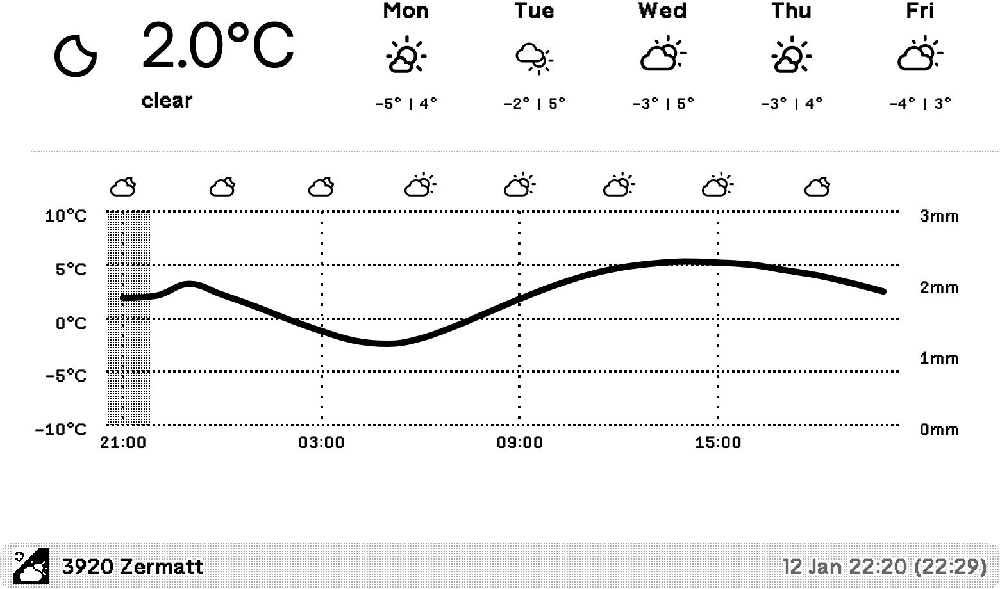
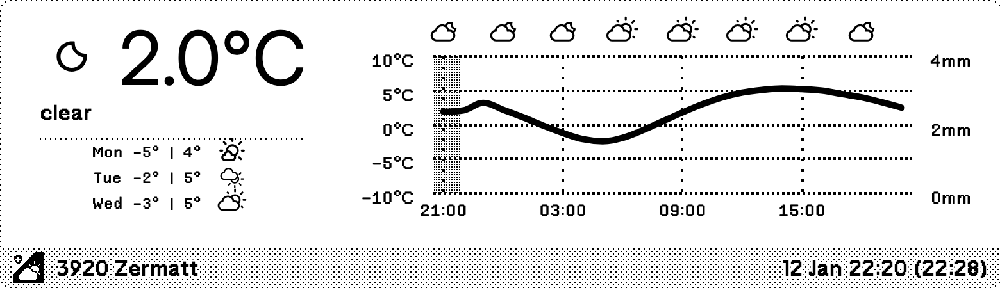
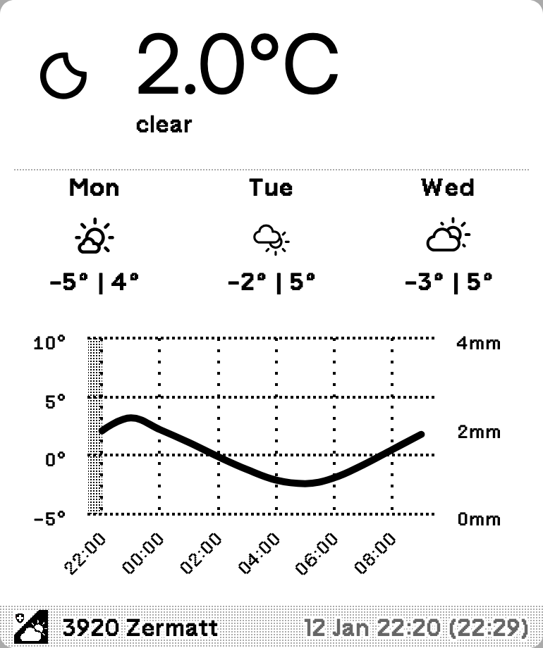
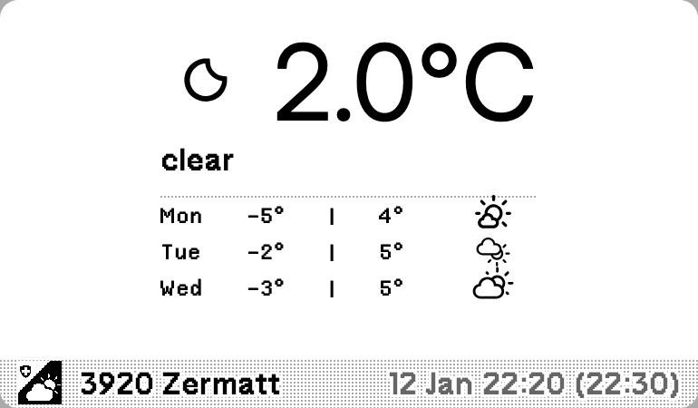

# MeteoSwiss Weather Plugin for TRMNL

A beautiful weather display plugin for [TRMNL](https://usetrmnl.com) that brings Swiss weather forecasts to your e-ink display.

## Overview

This plugin fetches real-time weather data from [MeteoSwiss](https://www.meteoswiss.admin.ch/), Switzerland's official weather service, and displays it on your TRMNL device. It provides hourly temperature and precipitation forecasts with a clean, easy-to-read layout optimized for e-ink screens.

### Why MeteoSwiss?

MeteoSwiss is the authoritative source for Swiss weather data. This plugin leverages their accurate, detailed forecasts to give you:

- **Accurate local weather** - Data from Switzerland's official meteorological institute
- **Multi-day forecasts** - Plan ahead with up to 5-day predictions
- **Hourly details** - See temperature and precipitation trends throughout the day
- **Multiple display options** - Choose from 4 different layouts to suit your needs

## How to Use

This plugin is currently not published on the TRMNL recipe store, but can be installed manually:

1. Install via: https://usetrmnl.com/recipes/224480
2. Configure your location using the Swiss postal code (PLZ)
3. Set your preferred display language (English, Deutsch, Français, or Italiano)
4. Choose your preferred layout (see Screenshots below)

The plugin updates every 15 minutes with the latest weather data.

## Screenshots

### Full

The most comprehensive layout. Shows large current weather, 5-day forecast across the top, with a full 24-hour detailed chart below. Best for larger screens.

### Half Horizontal

Displays current weather and 3-day forecast on the left, with a full 24-hour temperature and precipitation chart on the right. Great for detailed hourly analysis.

### Half Vertical

Stacks the current weather, 3-day forecast, and a 12-hour chart vertically. Perfect for portrait-oriented displays that need compact information density.

### Quadrant

Clean and simple. Displays just the current weather conditions and 3-day forecast. Ideal for quick glances without detailed hourly data.

## Weather Icons

The plugin uses a carefully curated mapping between MeteoSwiss weather symbols and TRMNL's icon library.

### Icon Mapping

- **MeteoSwiss symbols** - Switzerland's official weather symbols (see [Weather Symbols](https://www.meteoswiss.admin.ch/weather/weather-and-climate-from-a-to-z/weather-symbols.html))
- **TRMNL icons** - Weather icon set used by TRMNL (see [TRMNL Weather Icons](https://help.usetrmnl.com/en/articles/11823386-weather-icons))

The `/icons` folder contains:
- **`mapping.json`** - Complete mapping of all MeteoSwiss condition codes (1-142) to TRMNL icon names
- **`index.html`** - Interactive preview of all mapped icons and their descriptions

### Weather Descriptions

Weather condition descriptions are sourced from the official MeteoSwiss documentation files (XLSX and PDF) available at https://www.meteoswiss.admin.ch/weather/weather-and-climate-from-a-to-z/weather-symbols.html. These descriptions are available in German, French, Italian, and English.

To view the complete icon mapping and test them interactively, open `icons/index.html` in your browser.

## License & Contribution

You are welcome to use this plugin for your own private installations and modifications. However, **please do not submit this to the TRMNL recipe store** - I will handle the official publication myself.

If you find bugs or have improvements, feel free open and issue or send a pull request.

